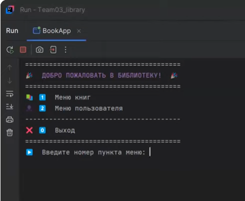
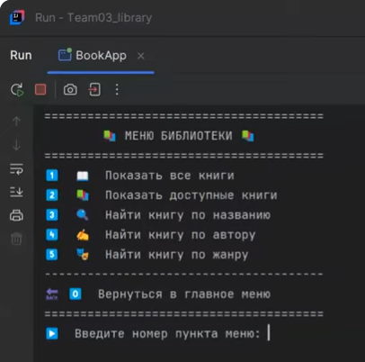
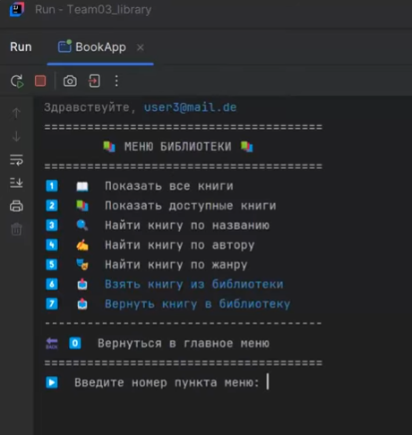
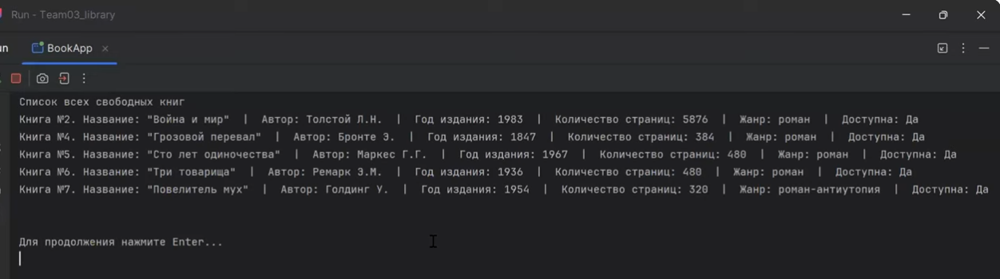
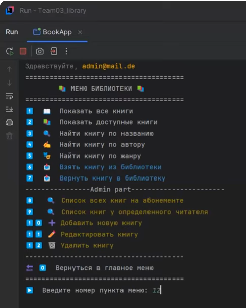
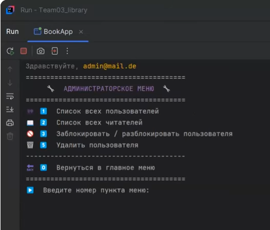
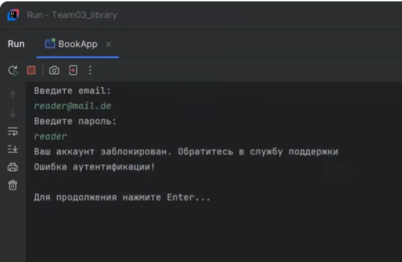
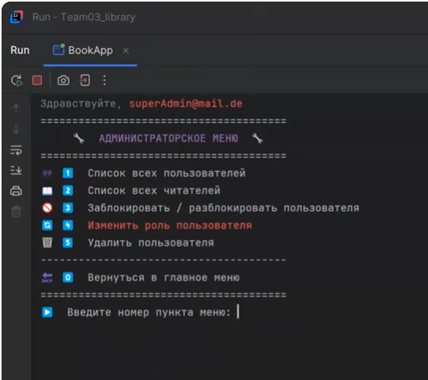

# 📚 Library Management System

A console-based **Library Management System** built in Java.  
Developed as a final team project after completing the **Java Basics course** at [AIT TR GmbH](https://ait-tr.de/).

---

## 🎓 About

This project was created as part of the **Fullstack Developer Program at AIT TR GmbH** (January – August 2025).  
The program included 960 hours of theory and 160 hours of practical training.  
The goal was to apply Java fundamentals in a real team-based project using a layered architecture.

---

## ✨ Features

### 👤 Guest (not logged in)
- View all books
- View available books
- Search by title, author, or genre

### 🔵 User (logged in)
- All guest features
- Borrow a book (add to subscription)
- Return a book
- View own subscription

### 🟡 Admin
- All user features
- View books currently on loan
- View books borrowed by a specific reader (by email)
- Add, edit, delete books
- View all users / readers
- Block / unblock users
- Delete users

### 🔴 Super Admin
- All admin features
- Manage admin roles — promote users to admin or demote admins to users
- The only role that can manage other admins (like `root` in Linux)

---

## 🏗 Architecture

The project follows a **layered architecture**:

```
src/
├── model/          # Entities: Book, User, Role
├── repository/     # Data access layer (CRUD operations)
├── service/        # Business logic
├── view/           # Console UI / menu
└── utils/          # Utilities (e.g. password hashing)
```

---

## 🛠 Tech Stack

- Java
- JUnit (≥ 80% service layer coverage)
- Base64 password hashing
- IntelliJ IDEA (with Robot API for console clear)

---

## 🚀 Getting Started

```bash
git clone https://github.com/AOgit/Team03_project.git
cd Team03_project
```

Open the project in **IntelliJ IDEA** and run `BookApp`.

### Default accounts

| Role | Email | Password |
|------|-------|----------|
| Super Admin | superAdmin@mail.de | *(set in seeder)* |
| Admin | admin@mail.de | *(set in seeder)* |

---

## 🖥 Screenshots

### Welcome screen & main menu


### Library menu (guest)


### Library menu (logged-in user) — borrow & return options appear


### Available books list


### Admin panel — library management


### Admin panel — user management


### Blocked account message


### Super Admin panel


---

## 👥 Team

Developed collaboratively using **Git Flow** — feature branches, pull requests, and code reviews.

---

## 📝 License

This project was created for educational purposes as part of the AIT TR GmbH Java course.
